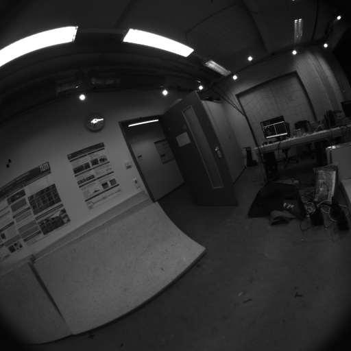
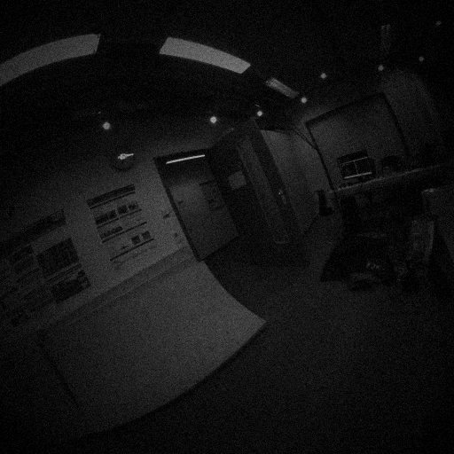

# Evaluation Round 1 — Day / Night / Hybrid comparison

*2026-07-06 · 3d_fisheye Phase 1 (first executable slice) · autonomous run*

## TL;DR

<!-- FILLED AFTER RUNS -->

## 1. What was actually run

**Data.** TUM-VI `room1` (512×512 fisheye stereo + 200 Hz IMU, ~146 m indoor
trajectory, mocap ground truth). The TUM mirror no longer serves the `.bag`
exports, so the EuRoC tar was converted with `bench/euroc2bag.py` (16-bit PNGs
mapped linearly to mono8, matching what cv_bridge did with the original bags).

**Conditions.** Three variants of the identical sequence:

| Condition | Generation |
|---|---|
| `day` | original imagery |
| `night` | photometric night+IR-flood proxy (`bench/degrade_bag.py`): image re-lit as reflectance × (4% ambient + gaussian beam vignette centered on the optical axis), plus high-gain sensor noise. Models the pod's camera-colocated 850 nm flood LED in darkness. |
| `transition` | day → night linear ramp over the middle 20% of the sequence (the "half day / half darkness" flight) |

| Day (frame 1500) | Night proxy (same frame) |
|---|---|
|  |  |

**Candidates.**

- **OpenVINS** (Track A, GPL yardstick) — stereo-inertial MSCKF, TUM-VI config,
  online camera-IMU calibration on, docker `3dfe/openvins`.
- **Basalt** (Track B, BSD product lane) — stereo-inertial optimization VIO,
  Double Sphere calibration, pinned pre-vcpkg commit `24acebe`, docker `3dfe/basalt`.
- **Hybrid front-end datapoint** (Track F2 evidence) — XFeat (Apache-2.0,
  CPU) vs ORB on identical frame pairs from the day and night bags:
  matching survival under the night+IR conditions.

**Metrics.** `bench/evaluate.py`: ATE (SE3-aligned RMSE), RPE@1s, coverage
(fraction of GT time span with estimates — the robustness number), dropout
gaps. Wall/CPU/RSS via in-container `timer_wrap.py`.

## 2. Results — VIO candidates × conditions

<!-- TABLE FILLED FROM bench/collect_results.py -->

## 3. Results — hybrid front-end (XFeat vs ORB)

Identical 40 frame pairs (0.5 s temporal baseline) from cam0, day vs night,
RANSAC (fundamental-matrix) verification:

| Front-end | Condition | Matches | Inliers (mean) | Inlier ratio | Pairs < 30 inliers |
|---|---|---:|---:|---:|---:|
| ORB (2048) | day | 396 | 211 | 49.8% | 2/40 |
| **XFeat** (2048) | day | 890 | **396** | 41.9% | **0/40** |
| ORB (2048) | night | 204 | 66 | 29.0% | **14/40** |
| **XFeat** (2048) | night | 815 | **293** | 33.7% | **0/40** |

Day → night, ORB loses **69%** of its inliers and drops below 30 inliers
(tracking-failure territory for a feature-based VIO) in **35%** of the pairs.
XFeat loses only **26%** and never falls below 30 inliers. That is the
clearest quantitative argument so far for the hybrid lane (learned front-end
over a classical backend) under the pod's night+IR operating mode.

## 4. Interpretation

<!-- FILLED AFTER RUNS -->

## 5. Honest limitations

1. **The night condition is a photometric proxy**, not the Isaac lighting
   axis: the flood illumination and noise are modeled, but **moving cast
   shadows** (drone-mounted light sweeping the scene) are not — those need the
   GPU sim bring-up. Night results here are a *lower bound* on difficulty.
2. **Real data, wrong rig**: TUM-VI is a synchronized global-shutter stereo
   rig, not the pod triangle with unsynchronized rolling-shutter cameras. The
   camera-count and skew axes of the matrix still need the sim benchmark.
3. **Timing measured on a loaded shared machine** (a Gazebo sim was running
   throughout) — wall/CPU numbers are indicative, not benchmarks.
4. Single sequence (`room1`), single run per cell — no variance estimates.
5. cuVSLAM (Track F1 headline) not yet run: needs the ROS 2 pipeline; AirSLAM
   (GPL yardstick) needs a TensorRT build. Both are the next cells to fill.

## 6. Next steps

- Fill the cuVSLAM and AirSLAM rows (day/night) — the product-lane decision
  needs them.
- Isaac lighting-axis bring-up on a ≥24 GB GPU host → replace the proxy with
  real moving-shadow night sequences + pod rigs (2/3 cams) + skew axis.
- Wire XFeat into an OpenVINS-style front-end (Track F2) and rerun the night
  column — the front-end study predicts a large coverage gain.
